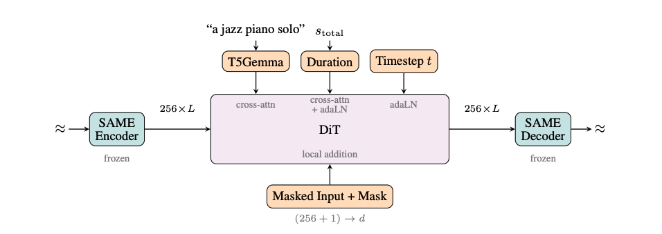
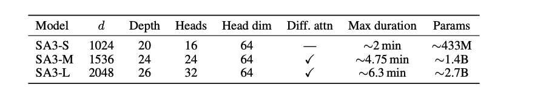

# Stable Audio 3 Model
> For a more in-depth breakdown of Stable Audio 3, please see our tech report

Stable Audio 3 is a family of text-conditioned audio generation models.

## Using the Model

Both configurations (Small and Medium) share the same interface - See the model table for hardware requirements and generation speed

| Input | Description |
|---|---|
| `prompt` | Text description of the audio to generate |
| `duration` | Length of audio to generate, in seconds (max X seconds) |

| Output | Value |
|---|---|
| Format | 44.1kHz Stereo audio |
| Bit depth | 32-bit float |

**Limitations**
- The model is not designed for speech or voice generation
- The model has been trained with English descriptions and will not perform as well in other languages.

## System Overview

There are two main pieces of the system: the SAME autoencoder and the diffusion-transformer (DiT).

**SAME Autoencoder**

Stable Audio includes a state-of-the-art stereo autoencoder, know as SAME (Semantic-Acoustic Music Encoder). SAME learns to compresses audio into 256-dimensional continuous latents (encoder) as well as reconstruct latents into audio (decoder). SAME is trained separately from the diffusion transformer.

**DiT**

The diffusion-transformer model learns to generate SAME latents given certain optional conditions, including text prompt and duration. When generating audio, these inputs are turned into embeddings that adjusts the model to create latents that match those conditions. These latents are then decoded using the pretrained SAME decoder into high quality audio.

## SAME
SAME compresses 44.1khz stereo audio into a continuous latent space with downsampling rate of 4096 and a latent of 256. This means that for a 10 second audio clip with 2 channels of 441k samples, the resulting compressed latent will be 108x256 (108 frames of 256).

SAME pushes the state-of-the-art in two mutually beneficial ways:
- It is a high-fidelity autoencoder that is trained to compress and reconstruct audio by preserving both low-level acoustic and high-level semantic details.
- It has been trained to encourage the latent space to be generatively tractable and semantically structured. Unlike like other compression models soley focused on reconstruction quality, SAME latents are easier for models to understand.

We train this model using a combinations of losses
- Reconstruction (how close can we match the original signal): We use a phase-aware spectral reconstruction loss to enforce perceptual high-fidelity.
- Adversarial (can we fool a separate model trained to recognize our artifacts): During training, we also train a GAN to force the model to reduce its artifacts
- Diffusion Alignment (how good are the latents for generation): During training, we also train a tiny diffusion model based on our Stable Audio DiT to force the model to output latents that this DiT model can understand
- Semantic (how well can it encode semantically meaningful audio concepts): We add small regression models based on pitch and stereo image to encourage the model to encode these into the latent space. We also have a text/audio contrastive critic that checks whether the latents stay consistent with both audio features and text descriptions, encouraging the model to encode rich, cross-modal meaning.

There are two variants to SAME: SAME-L and SAME-S.
- SAME-L: our best model and **requires a GPU** with support for sliding window attention to run.
- SAME-S: our fast model, aimed for **CPU and edge use**. It is a [distilled](https://labelbox.com/guides/model-distillation/) version of SAME-Large. Besides being smaller, it uses something we call *modified chunked attention with midpoint shift* as a workaround for sliding window attention.

TODO: Finish this table
Model Params Attention
SAME-S 266 M Chunked w/ MS
SAME-L 1.7 B Sliding Window

## DiT
The generative model for Stable Audio 3 is a conditional latent diffusion model, operating on the compressed SAME latents.

It includes 3 conditions:
- Text Conditioning. We encode text using a [T5Gemma model](https://deepmind.google/models/gemma/t5gemma/?tab=1-t5gemma).
- Timing Conditioning. The total duration of the audio, encoded via sinusoidal embeddings.
- Inpainting Conditioning. A SAME-encoded audio with an inpaint start/end-time can have a section filled-in or extended.

Training occurs in two main phases:
1. Rectified Flow (RF) Training
We use rectified flow aka flow-matching as our main training objective. The math can get a little complicated here, but put simply, we train a model to learn a trajectory from noise (randomness) to data (latents). One particularly cool feature is that we train with **variable-length diffusion**. Previously, if you just wanted to generate a short output, you will still have to generate a long sequence that would then be trimmed after generation, which sometimes could result in bad outputs. Now, if generating short sequences, it will understand that much better and also generate faster!

2. ARC Post-Training
Once the RF model is finished, it then undergoes some final steps to improve the quality and reduce the latency. This training is tricky, and is a bit more of an art than a science. After this final step, we have our high quality model!

There are three variants of DiTs
- Small: Good quality. Operates on SAME-S latents and is designed for CPU and edge generation.
- Medium: High Quality. Operates on SAME-L latents.
- Large (API-only, not available in this repo): Ultimate quality. Operates on SAME-L latents.

*TODO: Will replace this image with the actual table lol

## Provided Checkpoints
Checkpoints aka weights are the saved model artifacts that you use for inference.
TODO: fill this in.

## LoRA
Stable Audio supports LoRAs which is an easy way to fine-tune the models towards specific styles! See [LoRA guide](docs/workflows/lora.md). Importantly, to train a LoRA, you will use the RF model base checkpoint to train with. Once trained, you can then import the LoRA onto the ARC model, and it will work just fine!

## Datasets Licensed for Training
- [Freesound](https://freesound.org/)
- [AudioSparx](https://www.audiosparx.com/)