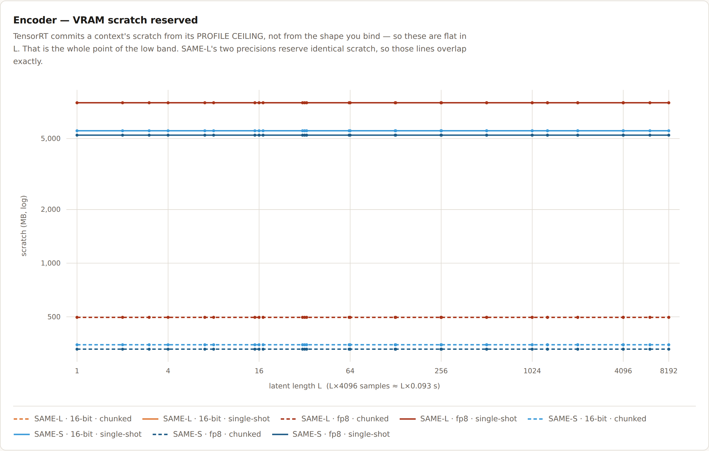
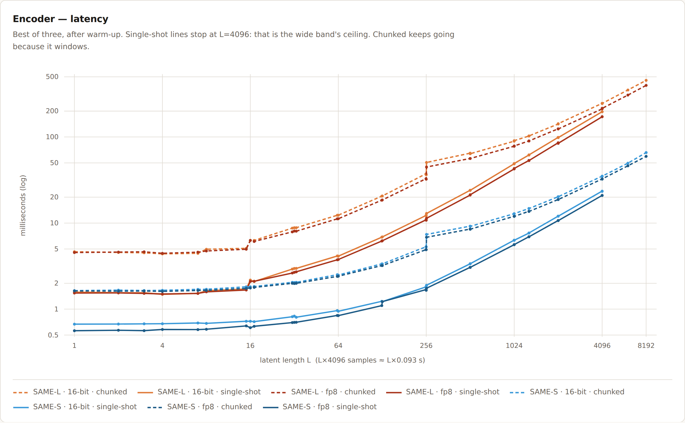
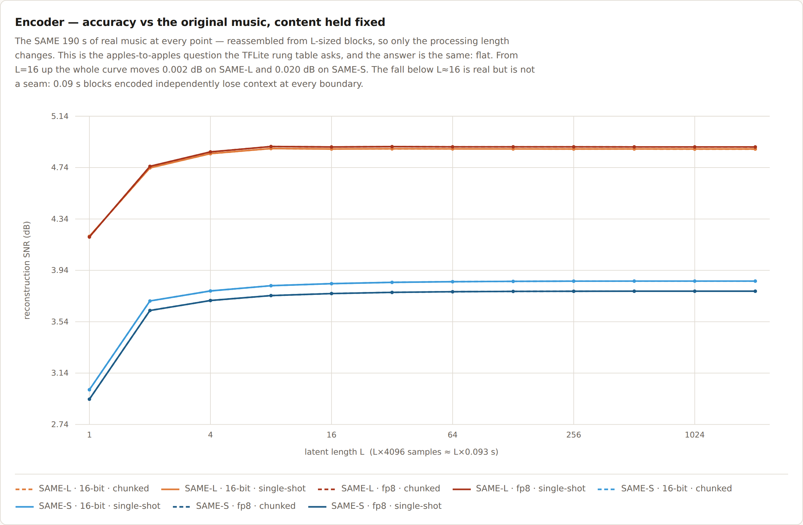
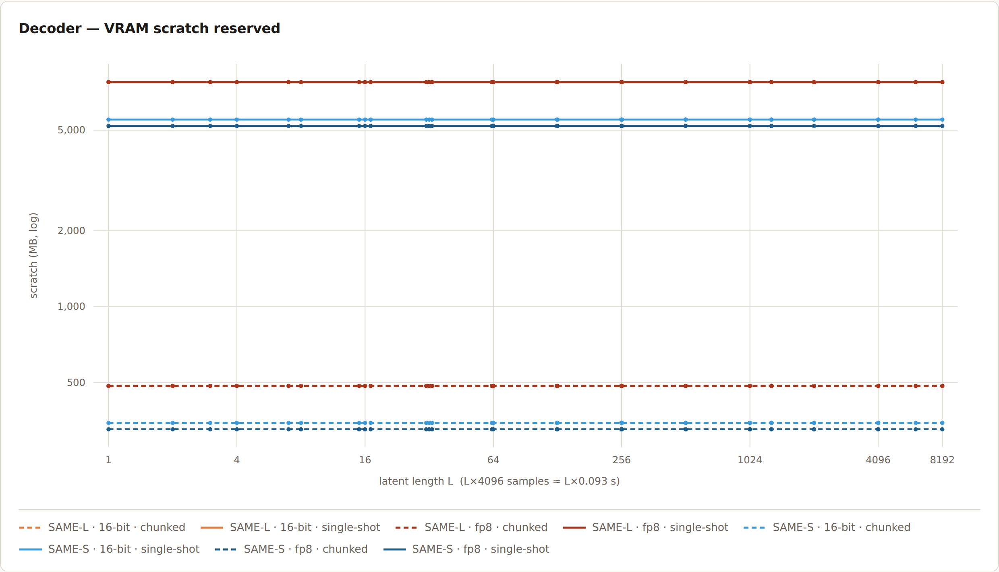
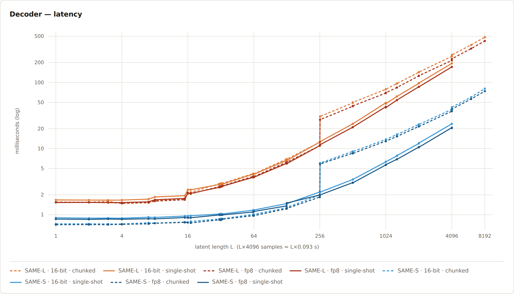
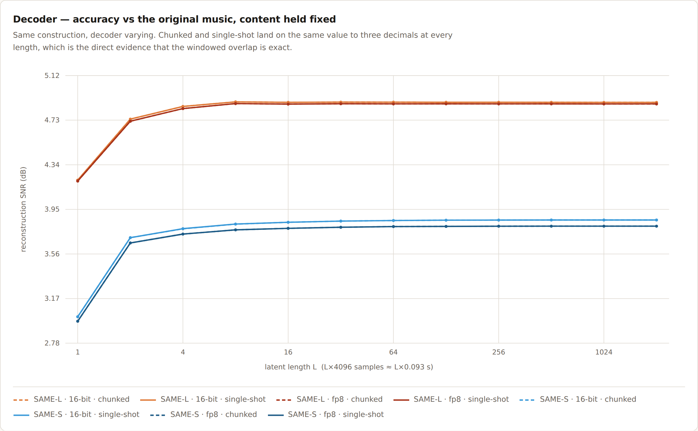

# SAME autoencoder benchmarks

Eight configurations — `{SAME-S, SAME-L} × {16-bit, fp8} × {chunked, single-shot}` — across
32 latent lengths from L=1 to L=8192. 16-bit means fp16 on SAME-L and bf16 on SAME-S, the
precision each model actually ships.

Open [`same-ae-sweep.html`](same-ae-sweep.html) for the interactive version — hover any point
for its value. It is self-contained (no external assets), so it works offline. The same six
charts are below.

### Encoder





### Decoder





## Reproducing

```bash
python ../scripts/bench_autoencoders.py --out same-ae-sweep.json --music /path/to/music
python ../scripts/make_ae_charts.py     same-ae-sweep.json same-ae-sweep.html
```

`--music` takes a directory, a file, or a `.npy` of shape `(2, samples)` at 44.1 kHz. **Use
real music, generated music, or SFX — never noise.** These autoencoders are strongly
content-dependent and noise fabricates numbers that do not hold on music. The figures below
come from seven mastered tracks (rock, jazz, classical, electronic, hip hop, piano, folk)
concatenated to 762 s: L=8192 is 761 s, longer than any single song, and tiling one track
would be artificially self-similar.

Measured on one H200 (sm_90).

## Results

| model | precision | dec scratch chunked | single-shot | dec ms @L=4096 chunked | single-shot | SNR L≥16 |
|---|---|---|---|---|---|---|
| SAME-L | 16-bit | 485 MB | 7,766 MB | 250.0 | 195.6 | 4.885–4.887 dB |
| SAME-L | fp8 | 485 MB | 7,766 MB | 216.4 | 172.6 | 4.871–4.873 dB |
| SAME-S | 16-bit | 346 MB | 5,512 MB | 39.3 | 23.7 | 3.836–3.856 dB |
| SAME-S | fp8 | 327 MB | 5,204 MB | 36.7 | 20.4 | 3.784–3.803 dB |

**VRAM is flat in L.** TensorRT commits a context's scratch from its *profile ceiling*, not
from the shape you bind, so the low band costs the same at L=1 as at L=8192. That is the
whole point of the two-profile build: 16× less scratch, for 2–5% end-to-end (the DiT
dominates a render).

**Chunked and single-shot are identical in accuracy** — to three decimals, at every length,
on both models and both precisions. Since single-shot has no seams at all, that is the direct
evidence the windowed overlap is exact.

**fp8 costs 0.014 dB** on SAME-L and 0.052 dB on SAME-S.

**Single-shot stops at L=4096**, the wide band's ceiling. Chunked keeps going because it
windows.

## Two measurement traps

**Accuracy must be measured with content held fixed.** The obvious construction — take the
first L latents, round-trip them, score against the original — turns the L axis into a
content walk, because a longer L is a *different, longer piece of music*. Measured: at a
fixed L, moving the excerpt swings SNR by **9.4–15.0 dB**, while the whole L axis at a fixed
offset moves **2.95 dB**. Content dominates by ~4×, so that chart plots the music, not the
model, and it looks like a length-dependent defect that is not there. The default
`--accuracy fixed` instead reassembles one region from L-sized blocks so only the processing
length changes; it comes out flat to 0.002 dB (SAME-L) above L=16. `--accuracy absolute`
keeps the naive construction when the absolute number is what you want.

There is one real effect below L≈16: SNR falls from 4.89 to 4.21 dB on SAME-L. That is not a
seam — it is 0.09 s blocks encoded independently, losing context at every boundary.

**Waveform SNR understates a perceptual autoencoder.** The same pipeline scores ~16 dB on
generated audio and ~5 dB on real masters, and published figures for this family span roughly
−23 dB (solo piano) to −4 dB (dense circus). Compare configurations to each other at a given
L; do not read the absolute height as a quality verdict, and do not let any of it substitute
for listening.

The level is not the limiter, though it looks like a suspect: the decoders bake a 0.977
ceiling and real masters here peak at 1.019. Re-measured with the input scaled from 0.9 down
to 0.225 the SNR moves 0.03 dB, and an optimal scalar gain-match recovers 0.27 dB.

The shipped SAME-S decoder also has a `RandomNormalLike` at its bottleneck, so its round trip
carries run-to-run variance belonging to neither precision nor chunking.
